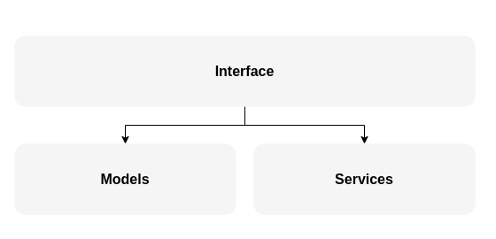

# Documento de Arquitetura
---
## 1. Introdução

### 1.1 Propósito

    Este documento descreve a arquitetura de um sistema desenvolvido para analisar planilhas CSV com dados de pacientes, identificar aqueles aptos a receber mensagens e enviar mensagens personalizadas via WhatsApp utilizando serviços de mensageria. O objetivo é otimizar a comunicação e agilizar o processo de agendamento de exames. Espera-se alcançar melhorias significativas nos seguintes pontos:
    

- **Aumento da taxa de conversão:** Facilitando o agendamento de exames.
- **Otimização do uso de recursos:** Eficiência no processamento e envio das mensagens.
- **Fortalecimento do relacionamento** com pacientes: Comunicação mais eficiente e personalizada.

### 1.2 Escopo

A solução automatiza a identificação de pacientes aptos a realizar exames de imagem, utilizando uma abordagem inteligente e proativa. O processo começa com a coleta de dados diretamente das planilhas do Google Sheets, acessadas via API do Google Drive. A partir dessa base, a análise é realizada com base no código TUSS(para dados estruturados) e IA BioBERT( para dados não estruturados), que identifica receitas médicas e verifica a necessidade de exames de imagem. Os pacientes identificados são filtrados e recebem mensagens personalizadas via WhatsApp, incentivando-os a agendar os exames.

O RabbitMQ gerencia a fila de envios, enquanto a API do WhatsApp efetivamente realiza a comunicação com os pacientes. Os registros de envio são armazenados na mesma planilha de origem, facilitando o acompanhamento e análise dos dados. A integração com o Looker Studio permite a criação de dashboards para monitorar o desempenho do sistema, como a taxa de envio. A arquitetura do sistema garante automação e flexibilidade para ajustes conforme o volume de pacientes e evolução das necessidades, com foco na segurança e conformidade com normas de privacidade.

---

## 2. Representação Arquitetural
### 2.1 Definições

O padrão arquitetural utilizado neste sistema se trata da arquitetura monolítica modular, um estilo de desenvolvimento de software que combina a estrutura de uma aplicação monolítica com princípios de modularização. Nesse modelo, toda a aplicação é desenvolvida e implantada como uma única unidade, compartilhando o mesmo espaço de memória, banco de dados e recursos. No entanto, ao invés de ter um código monolítico rígido e difícil de manter, a aplicação é organizada em módulos independentes, cada um com suas próprias responsabilidades e lógica específica.

Essa modularização interna permite que cada módulo funcione como uma unidade autônoma dentro do monólito, facilitando a manutenção, a escalabilidade e o reaproveitamento de código. Embora o deploy ainda ocorra de forma conjunta, as mudanças realizadas em um módulo tendem a impactar menos outras partes da aplicação, tornando o processo de desenvolvimento mais seguro e eficiente.

A arquitetura monolítica modular é especialmente vantajosa para projetos que ainda não exigem uma abordagem mais complexa, como microsserviços, mas que precisam de uma estrutura organizada e preparada para crescer de forma sustentável. Essa abordagem é bastante utilizada em projetos que buscam equilíbrio entre simplicidade na implantação e boa separação de responsabilidades no código.

### 2.2 Justificativa

A escolha da arquitetura monolítica modular foi motivada por sua adequação às necessidades do projeto, oferecendo uma solução eficaz sem adicionar complexidade desnecessária. Essa abordagem proporciona diversos benefícios, como <b>facilidade de manutenção</b>, <b>organização</b> e <b>reutilização de código</b>. Além disso, é especialmente propícia para a aplicação dos princípios S.O.L.I.D, promovendo um design de software mais limpo e sustentável.

---

## 3. Detalhamento

Figura 1 - Diagrama de referência arquitetural

<b>Elementos do modelo no presente sistema:</b> 

<b>1 - Entrada de dados:</b> API do Google para buscar dados das planilhas na Web

<b>2 - Processamento:</b> Componente Interface

<b>3 - Serviço de Mensageria:</b> utilizando RabbitMQ

<b>4 - Interface de Agendamento:</b> Fora do escopo

<b>5 - Visualização de dados:</b> Looker Studio e StreamLit

<b>6 - Modelo de Machine Learning:</b> BioBERT

<b>7 - Saída de dados:</b> API do Google para inserir/atualizar dados das planilhas na Web

Portanto o diagrama de arquitetura fica no seguinte formato: 

Figura 2 - Diagrama de Arquitetura

---

## 4. Metas e Restrições Arquiteturais
### 4.1 Metas Arquiteturais

As metas arquiteturais do sistema foram definidas para atender às necessidades funcionais e não funcionais da aplicação, garantindo eficiência, segurança e implatação em ambientes de produção:

#### 4.1.1 Implatação

A implantação será feita de maneira simples e eficiente, com uso de ferramentas como Docker para contêineres, garantindo que o sistema seja facilmente replicável em diferentes ambientes.

#### 4.1.2 Segurança de dados

Devido ao uso das APIs do Google e ao armazenamento dos dados no Google Drive, questões de LGPD e segurança dos dados sensíveis são cobertas pelos sistemas de autenticação e autorização do Google.

#### 4.1.3 Eficiência e Manutunibilidade: 

A arquitetura modular facilita a adição de novos recursos e a manutenção do sistema, além de permitir atualizações de forma ágil, sem comprometer a estabilidade.

### 4.2 Restrições Arquiteturais
#### 4.2.1 Compatibilidade com navegadores

O sistema deve ser compatível com navegadores modernos (Chrome, Firefox, Edge, Safari) e dispositivos móveis com tela mínima de 5 polegadas.

<b>Justificativa:</b> É importante garantir o acesso a diferentes formatos de dispostivos, impedindo que haja barreiras e limites tecnológicos.

#### 4.2.2 Armazenamento de dados

O sistema utilizará o Google Drive para armazenar planilhas CSV. O plano gratuito do Google Drive oferece 15 GB de armazenamento, o que é suficiente para armazenar as planilhas de dados estruturados e não estruturados.

<b>Justificativa:</b> Aproveitar a infraestrutura já disponível e escalável do Google Drive.

#### 4.2.3 Visualização gráfica de dados
A visualização de dados será realizada através do Streamlit para exibição de tabelas e do Looker Studio para gráficos interativos e relatórios.

<b>Justificativa:</b> Essas ferramentas oferecem flexibilidade e são ideais para análise de dados em tempo real e visualização de grandes volumes de dados.

---

## 5. Visão Lógica

A visão lógica do sistema descreve a organização dos componentes e como eles se relacionam para oferecer as funcionalidades propostas. A aplicação é estruturada em três grandes camadas: <b>Interface</b>, <b>Models</b> e <b>Services</b>. Cada camada é composta por módulos que encapsulam responsabilidades específicas, facilitando a manutenção, evolução e reutilização do código.

### Interface

**Objetivo:**
Oferecer uma interface simples e direta para que o usuário visualize tabelas, dashboards e interaja com o sistema utilizando o Streamlit. Essa camada é responsável por gerenciar as entradas do usuário, validar os dados e orquestrar as chamadas aos módulos de processamento e serviços de backend.

**Principais Funcionalidades:**

- **Renderização da Interface:**  
    - `user_interface.py`: Implementa a interface principal usando Streamlit, permitindo a visualização de dados e a interação com o sistema.

- **Autenticação de Usuários:**  
    - `authenticator.py`: Gerencia a autenticação, garantindo acesso seguro e restrito conforme as políticas definidas.

- **Envio de Mensagens:**  
    - `message_sender.py` e `ui_send_message.py`: Responsáveis pelo disparo de mensagens, integrando a camada de interface com os serviços(componente Services) e processamento de dados(componente Models).

- **Processamento de Dados:**  
    - `processor.py`, `structured_processor.py` e `no_structured_processor.py`: Executa o processamento de dados, aplicando os devidos filtros e analises dos dados estruturados e não estruturados.

- **Integração com Planilhas:**  
    - `update_sheet.py`: Atualiza as planilhas da web.

### Models

**Objetivo:**
Fornecer a lógica de Machine Learning (ML) e processamento de dados para analisar e classificar os clientes como aptos ou não a receberem mensagens.

**Principais Funcionalidades:**

- **Classificação de Exames:**  
    - `exam_classifier.py`: Analisa exames identificando padrões e possíveis anomalias nos dados e classifica a relação do exames com imagens.
    
- **Verificação de Imagens:**  
    - `img_exam_checker.py`: Processa os textos identificando palavras chaves que tornam o exame do cliente de acordo com as regras de negócio.

- **Limpeza e Pré-processamento de Texto:**  
    - `text_cleaner.py`: Sanitiza os dados textuais, preparando-os para análises subsequentes do modelo de ML.

### Services

**Objetivo:**
Oferecer conexões e integrações com APIs externas e serviços de mensageria, como Google Sheets para armazenamento e visualização de dados e RabbitMQ para comunicação assíncrona. Essa camada atua como intermediária na comunicação entre o sistema e o mundo externo, garantindo a troca de informações de forma robusta e escalável.

**Principais Funcionalidades:**

- **Consumo de Mensagens:**  
    - `consumer.py`: Consome as mensagens da fila de mensageria do RabbitMQ.

- **Publicação de Mensagens:**  
    - `publisher.py`: Gerencia o envio de mensagens para a fila de mensageria do RabbitMQ.

- **Envio Direto de Mensagens:**  
    - `send_message.py`: Envia mensagem no Whatsapp do cliente apto a receber de acordo com as regras de negócio.

- **Integração com Google Sheets:**  
    - `google_sheets.py`: Faz a conexão com as APIs do Google (Google Drive e Google Sheet).

Essa visão lógica reflete uma abordagem modular dentro de um monólito, onde cada pacote (Interface, Models e Services) é responsável por uma parte distinta da aplicação. Essa separação promove a manutenção, a evolução e a integração eficiente do sistema com serviços externos.

Figura 3 - Diagrama de Camadas

---

## 7. Visão de Implantação

A Visão de Implantação descreve como o sistema será disponibilizado e executado no ambiente de produção. Essa seção abordará as tecnologias escolhidas para a construção e execução do sistema, como Python, RabbitMQ e Docker, destacando suas justificativas. Além disso, apresentará a estratégia de implantação em serviços cloud.

### 7.1 Tecnologias e Justificativas

- **Python:** Linguagem de programação back-end  
    - **Justificativa:** O Python é amplamente utilizado para tarefas de análise de dados devido às suas poderosas bibliotecas como pandas e streamlit. Sua simplicidade e facilidade de integração com modelos de Machine Learning (como o BioBERT) tornam-no uma escolha ideal para esse projeto.

- **RabbitMQ:** Serviço de mensageria Open-Source sendo rodado no Docker  
    - **Justificativa:** RabbitMQ é uma solução robusta e confiável para mensageria, permitindo uma comunicação assíncrona eficiente entre os componentes do sistema. Sua simplicidade e flexibilidade são adequadas para o envio de mensagens para os usuários no WhatsApp.

- **Docker:** Plataforma de containerização  
    - **Justificativa:** Docker é uma ferramenta crucial para garantir que o ambiente de desenvolvimento e produção sejam idênticos, isolando dependências e evitando problemas de configuração. Isso facilita o processo de implantação, bem como a manutenção e a escalabilidade do sistema.

**Bibliotecas**:

- **PyTorch:** Biblioteca de Deep Learning e Machine Learning
    - **Justificativa:** PyTorch é utilizado para executar o modelo BioBERT, uma rede neural pré-treinada para Processamento de Linguagem Natural (PLN). Sua flexibilidade e alto desempenho são essenciais para o processamento de dados médicos e a identificação de padrões, como a análise de receitas médicas.

- **re:** Expressões regulares em Python  
    - **Justificativa:** A biblioteca `re` é usada para realizar o pré-processamento de textos, removendo caracteres indesejados e outros elementos que podem interferir na análise de texto do BioBERT. Sua simplicidade e poder tornam-na ideal para a limpeza de dados textuais.

- **pandas:** Biblioteca para manipulação de dados  
    - **Justificativa:** pandas é uma ferramenta fundamental para a manipulação e transformação de dados em DataFrames. Ela proporciona operações rápidas e eficientes de leitura, escrita e filtragem de dados.

- **Streamlit:** Biblioteca Python open-source para desenvolvimento de aplicações web interativas  
    - **Justificativa:** Streamlit é uma biblioteca altamente versátil e fácil de usar para a criação interfaces(UI) de dados. Ela permite uma rápida prototipagem e customização das visualizações de dados, facilitando a interação dos usuários com as informações, sem necessidade de um front-end complexo.

- **gspread:** Biblioteca Python para trabalhar com o Google Sheets  
    - **Justificativa:** gspread é a escolha para a integração com a API do Google Sheets, permitindo a leitura, escrita e atualização de planilhas de maneira simples. Sua utilização facilita a manipulação de dados armazenados no Google Drive, essencial para o fluxo de informações no sistema.

**Modelo de Machine Learning:**

- **BioBERT:** Modelo de ML (Machine Learning)  
    - **Justificativa:** BioBERT é um modelo pré-treinado específico para Processamento de Linguagem Natural (PLN) na área biomédica. Ele é altamente eficaz para a análise de textos médicos, como receitas e exames, devido ao seu treinamento em grandes bases de dados biomédicos. Sua utilização permite a identificação precisa de padrões em textos, como a extração de informações relevantes, tornando-o ideal para esse projeto de análise de dados médicos e classificação de exames.

### 7.2 Estratégia de implantação

O sistema será implantado na web, utilizando um ambiente de produção em serviços cloud para garantir integração e autenticação com as APIs. A escolha recai sobre a **Google Cloud Platform (GCP)**, pela sinergia com os serviços do Google Sheet e Google Drive.

**Infraestrutura:**

- **Google Cloud Run:**  
  Utilização do Cloud Run para hospedar tanto o sistema quanto o serviço de mensageria em contêineres separados, permitindo escalonamento automático e otimização de custos.  

  *Exemplo:* Para workloads de baixa demanda, o Cloud Run cobra apenas pelo tempo de execução (CPU e memória) e pelo tráfego de dados, tornando-o mais econômico que uma VM sempre ativa, fonte: https://cloud.google.com/run.

- **Benefícios de utilizar o Cloud Run:**

- Escalabilidade automática baseada na demanda.  
- Menor custo para cargas de trabalho intermitentes.  
- Deploy simplificado via comandos `gcloud`.  
- Gerenciamento automático de certificados SSL e balanceamento de carga.  

A orquestração dos contêineres será gerida diretamente pelo Cloud Run, dispensando a necessidade do Docker Compose no ambiente de produção.

---

## 8. Restrições Adicionais

As restrições adicionais do sistema foram definidas para garantir que o software atenda aos requisitos de negócios e de qualidade necessários ao seu funcionamento, além de proporcionar uma experiência segura e eficiente para o usuário.

### Restrições de Negócios
<b>Autenticação Obrigatória:</b>

O sistema será acessível diretamente pela internet, mas exigirá que usuários previamente cadastros se autentiquem utilizando credenciais específicas (usuário e senha)

- <b>Justificativa: </b>A autenticação garante que somente usuários autorizados tenham acesso às informações sensíveis dos clientes.

<b>Acesso Restrito a Perfis em Serviços da Google:</b>

Funcionalidades críticas, como inserção, edição, remoção e visualização de dados das planilhas via serviços do Google, como Google Drive e Looker studio, necessitam de autorização sobre aquele documento na plataforma (Google Drive, Looker Studio) seja pra inserir, editar, visualizar ou deletar.

 

- <b>Justificativa:</b> A segmentação de funcionalidades por perfis de acesso melhora a segurança e organização do fluxo de trabalho.

### Restrições de Qualidade

<b>Usabilidade:</b>

O sistema possui uma interface amigável e intuitiva para aqueles com menores experiências em análise de dados, e para os mais experientes oferecem a visualização de dados pelo looker studio, onde possui painel interativo.

- <b>Justificativa:</b> Um design flexível facilita o uso do sistema por diferentes perfis de usuários com diferentes graus do conhecimento.

<b>Portabilidade:</b>

O software será compatível com dispositivos móveis (Android e iOS) e navegadores modernos (Chrome, Firefox, Safari, Edge).

- <b>Justificativa:</b> Garantir o acesso em múltiplas plataformas facilita o uso por usuários em diferentes contextos e dispositivos.

<b>Manutenibilidade:</b>

O código é modular e bem documentado, seguindo os padrões de desenvolvimento, para facilitar correções de erros e futuras expansões.

- <b>Justificativa:</b> A capacidade de realizar manutenção eficiente é fundamental para garantir a evolução contínua do sistema e atender a novas demandas.

---

## 9. Bibliografia

DOCKER. *Documentação oficial do Docker*. Disponível em: <https://docs.docker.com/>. Acesso em: 12 mar. 2025.

RABBITMQ. *Documentação oficial do RabbitMQ*. Disponível em: <https://www.rabbitmq.com/docs>. Acesso em: 12 mar. 2025.

RABBITMQ COM PYTHON. *RabbitMQ com Python*. Disponível em: <https://youtu.be/6PHr1NwlQaU?si=Zn_N5KD4kkzUnwiJ>.

HUGGING FACE. *Hugging Face*. Disponível em: <https://huggingface.co/>. Acesso em: 12 mar. 2025.

PYTHON. *Documentação oficial do Python*. Disponível em: <https://docs.python.org/pt-br/>. Acesso em: 12 mar. 2025.

STREAMLIT. *Documentação oficial do Streamlit*. Disponível em: <https://docs.streamlit.io/>. Acesso em: 12 mar. 2025.

YOUTUBE. *Como usar as IAs do Hugging Face*. Disponível em: <https://www.youtube.com/watch?v=Vlv2GAGcPgI>. Acesso em: 12 mar. 2025.

## Tabela de Versionamento

Abaixo está o histórico de versões do documento presente:

<table style="width: 100%; border-collapse: collapse;">
  <tr style="background-color: #334bff;color: white;">
  
    <th>Versão</th>
    <th>Data</th>
    <th>Descrição</th>
  </tr>
  <tr>
    <td>1.0.0</td>
    <td>11/03/2025</td>
    <td>Criação do documento.</td>
  </tr>
</table>

