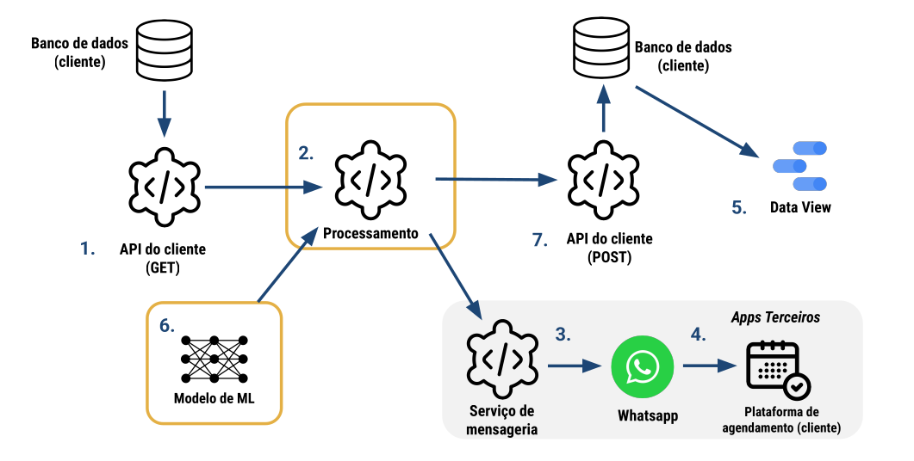
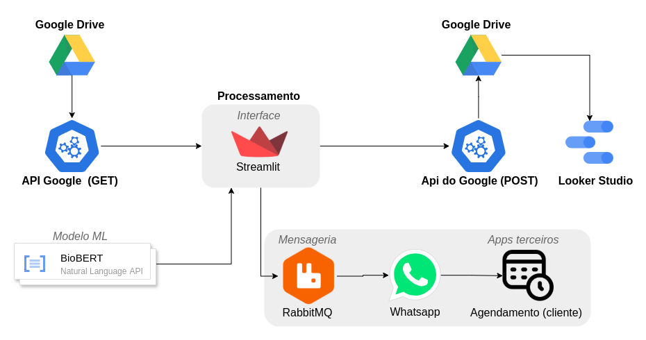

# Documento de Arquitetura

## 1. Introdução

### 1.1 Propósito

    Este documento descreve a arquitetura de um sistema desenvolvido para analisar planilhas CSV com dados de pacientes, identificar aqueles aptos a receber mensagens e enviar mensagens personalizadas via WhatsApp utilizando serviços de mensageria. O objetivo é otimizar a comunicação e agilizar o processo de agendamento de exames. Espera-se alcançar melhorias significativas nos seguintes pontos:
    
    Aumento da taxa de conversão: Facilitando o agendamento de exames.
    Otimização do uso de recursos: Eficiência no processamento e envio das mensagens.
    Fortalecimento do relacionamento com pacientes: Comunicação mais eficiente e personalizada.

### 1.2 Escopo

A solução automatiza a identificação de pacientes aptos a realizar exames de imagem, utilizando uma abordagem inteligente e proativa. O processo começa com a coleta de dados diretamente das planilhas do Google Sheets, acessadas via API do Google Drive. A partir dessa base, a análise é realizada com base no código TUSS e na IA BioBERT, que identifica receitas médicas e verifica a necessidade de exames de imagem. Os pacientes identificados são filtrados e recebem mensagens personalizadas via WhatsApp, incentivando-os a agendar os exames.

O RabbitMQ gerencia a fila de envios, enquanto a API do WhatsApp efetivamente realiza a comunicação com os pacientes. Os registros de envio são armazenados na mesma planilha de origem, facilitando o acompanhamento e análise dos dados. A integração com o Looker Studio permite a criação de dashboards para monitorar o desempenho do sistema, como a taxa de resposta e os agendamentos realizados. A arquitetura do sistema garante escalabilidade, automação e flexibilidade para ajustes conforme o volume de pacientes e evolução das necessidades, com foco na segurança e conformidade com normas de privacidade.

## 2. Representação Arquitetural
### 2.1 Definições

arquitetura monolítica modular

### 2.2 Justificativa

A escolhada monolitica modular foi motivada pela facilidade em atenter o problema e ser suficiente para isso, não complicando o problema e trazendo beneficios como:

#### 2.2.1 Simplicidade de Implementação e  Implatação

A aplicação monolítica é implantada como um único artefato, simplificando o processo de implantação, pois não é necessário lidar com múltiplos serviços ou containers.

#### 2.2.2 Menos sobrecarga operacional

A manutenção de um único sistema facilita a gestão de recursos e reduz a complexidade operacional, especialmente em um contexto inicial do projeto.

#### 2.2.3 Facilidade de Comunicação entre módilos

Em uma arquitetura monolítica, a comunicação entre os módulos é mais eficiente, sem a necessidade de protocolos de rede complexos, como em sistemas distribuídos.

#### 2.2.4 Modularidade e manutenção

Apesar de ser monolítica, a aplicação será modularizada, permitindo fácil manutenção e evolução sem afetar o sistema como um todo.

#### 2.2.6 Menor complexidade de segurança

## 3. Detalhamento

Figura 1 - Diagrama de referência arquitetural

Figura 2 - Diagrama de Arquitetura Monolitíca Modular

## 4. Metas e Restrições Arquiteturais
### 4.1 Metas Arquiteturais

As metas arquiteturais do sistema foram definidas para atender às necessidades funcionais e não funcionais da aplicação, garantindo eficiência, segurança e implatação em ambientes de produção:

#### 4.1.1 Implatação

A implantação será feita de maneira simples e eficiente, com uso de ferramentas como Docker para contêineres, garantindo que o sistema seja facilmente replicável em diferentes ambientes.

#### 4.1.2 Segurança de dados

Devido ao uso das APIs do Google e ao armazenamento dos dados no Google Drive, questões de LGPD e segurança dos dados sensíveis são cobertas pelos sistemas de autenticação e autorização do Google.

#### 4.1.3 Eficiência e Manutunibilidade: 

A arquitetura modular facilita a adição de novos recursos e a manutenção do sistema, além de permitir atualizações de forma ágil, sem comprometer a estabilidade.

### 4.2 Restrições Arquiteturais
#### 4.2.1 Compatibilidade com navegadores

O sistema deve ser compatível com navegadores modernos (Chrome, Firefox, Edge, Safari) e dispositivos móveis com tela mínima de 5 polegadas.

Justificativa: É importante garantir o acesso a diferentes formatos de dispostivos, impedindo que haja barreiras e limites tecnológicos.

#### 4.2.2 Armazenamento de dados
O sistema utilizará o Google Drive para armazenar planilhas CSV. O plano gratuito do Google Drive oferece 15 GB de armazenamento, o que é suficiente para armazenar as planilhas de dados estruturados e não estruturados.

Justificativa: Aproveitar a infraestrutura já disponível e escalável do Google Drive.

#### 4.2.3 Visualização gráfica de dados
A visualização de dados será realizada através do Streamlit para exibição de tabelas e do Looker Studio para gráficos interativos e relatórios.

Justificativa: Essas ferramentas oferecem flexibilidade e são ideais para análise de dados em tempo real e visualização de grandes volumes de dados.

## 5. Visão de Casos de uso (escopo do produto)
O diagrama abaixo destaca os casos de uso da aplicação e interações do usuário com o sistema como um todo:

## 6. Visão Lógica
O sistema é dividido em três pacotes de módulos:

* <b>Interface</b>
    * Objetivo:
        - Oferecer uma interface simples e direta para que o usuário consiga visualizar as tabelas/plabilhas e enviar as mensagens mensagens, tudo pelo Streamlit.
    * Módulos:
        - <b>user_interface.py:</b> Facilita a interação com o sistema, seja para visualizar, filtrar dados, ou enviar mensagens. 

* <b>Models</b>
    * Objetivo:
        - Oferecer lógica de modelo ML(Machine Learning) para processar e analisar textos.
    * Módulos:
        - <b>exam_classifier.py:</b> Contém classes que são suficientes para analiser modelo ML pré-treinado BioBERT 

* <b>Services</b>:
    * Objetivo: 
        - ferecer conexões e serviços de APIs, como Google, RabbitMQ.
    * Módulos
        - <b>consumer.py:</b> contém a classe que consome os mensagens da fila do RabbitMQ
        - <b>google_sheets.py:</b> contém a classe que se conecta com as APIs do Google para manipular as tabelas
        - <b>publisher.py:</b> contém a classe que publica as mensagens na fila do RabbitMQ
        - <b>send_message.py:</b> contém a classe que envia mensagens no whatsapp antes de serem consumidas no RabbitMQ

Diagrama de classes:

## 7. Visão de Implementação

## 8. Visão de Implantação
O ideal é que o sistema seja implantado em um ambiente de produção com serviços cloud que facilite a integração e autenticação do sistema com as APIs,
em virtude disso a melhor opção seria o GCP (Google Cloud Platform)

### 8.1 Infraestrutura de hardware

### 8.2 Tecnologias e Justificativas
 - Python
 - Streamlit
 - RabbitMQ
 - Docker

 Biblioteca:
 pytorch: para rodar o bioBERT
 re: para limpar textos indesejados para o bioBERT
 pandas: para manipular e transformar em dataFRames
 streamlit: para apresentar uma interface visual amigável para interagir com o sistema
 gspread: para se conectar com a API do google e conseguir manipular

### 8.3 Estratégia de implantação
Fases de Implantação:

Implantação Contínua:

A implantação será realizada de forma contínua, utilizando ferramentas como Docker, Kubernetes para facilitar atualizações e manutenção contínua.

### 8.4 Monitoramento e manutenção

### 8.5 Diagrama de implantação

## 9. Restrições Adicionais
## 10. Bibliografia

LUCIDCHART. Tudo sobre diagramas de pacotes UML. Disponível em: https://www.lucidchart.com/pages/pt/diagrama-de-pacotes-uml. Acesso em: 18 dez. 2024.

## Tabela de Versionamento

Abaixo está o histórico de versões do documento presente:

<table style="width: 100%; border-collapse: collapse;">
  <tr style="background-color: #334bff;color: white;">
  
    <th>Versão</th>
    <th>Data</th>
    <th>Descrição</th>
  </tr>
  <tr>
    <td>1.0.0</td>
    <td>11/03/2025</td>
    <td>Criação do documento.</td>
  </tr>
</table>

